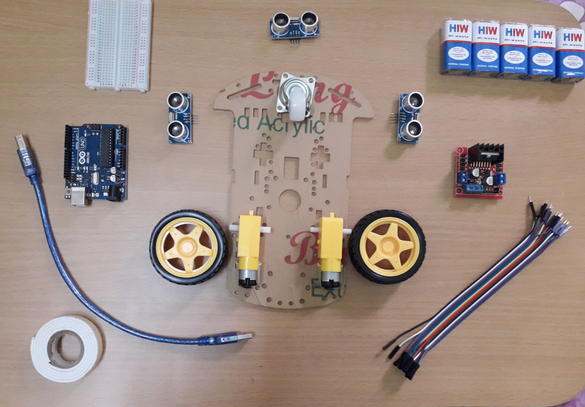

# Objective
The robot should be able find its way out of the maze on its own.

# Components

- Arduino Uno: 1
- DC Motor: 2
- Motor driver: 1
- Ultrasonic sensor: 3
- Wheel: 2
- Castor: 1
- Chassis: 1
- 9V Battery: 1
- Jumper wire: As required
- Breadboard: 1

# Algorithm
There are many algorithms to solve the maze. I have used left wall follower algorithm. This algorithm works if the maze is simply connected. The idea is to keep one hand always in contact with one wall of the maze either left or right. If there is a exit, and maze is simply connected then robot will definitely reach the exit. 

Turn priority in left wall following algorithm: 
- Left
- Forward
- Right

